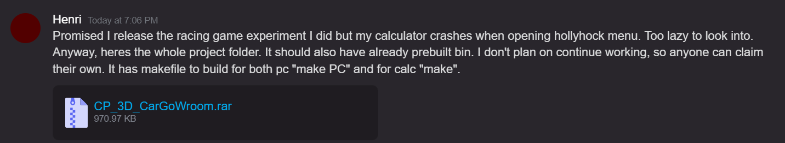

3D Renderer using fixed point math. For casio ClassPad ii fx-cp400


https://github.com/ClasspadDev/CP-3D-CarGoWroom/assets/13310559/99807a22-c964-4338-ba07-8b30e5b67984

> [!NOTE]
> The code was originally done by [Henri](https://github.com/im-henri/) and given away to the community

New maintainer are welcome ! 

# Install

[](https://github.com/ClasspadDev/CP-3D-CarGoWroom/releases)

Go to the [releases](https://github.com/ClasspadDev/CP-3D-CarGoWroom/releases) and get the latest build

# Features

- .obj models (converted to binary format)
- Textures
- Lighting
- 6 different render modes

# Controls


```
8 4 2 6 9 3 = Camera rotation
D-PAD       = Movement
+ -         = FOV +/-
0           = Render Mode Cycle
Clear       = Exit
```

# Modding

## Custom car

You'll need to create simple 3D models in the [Wavefront OBJ format](https://en.wikipedia.org/wiki/Wavefront_.obj_file) with PNG textures and then converted to binary by editing and running the script
```
python python/ObjTexConverter.py
```
> [!WARNING]
> Running this may overwrite the pkObj and texture files

You can take a look at "3D_models" folder to get a better understanding at the example cars

## Custom map

To create your own maps, go to `python/MapCreator.py` and edit the `myMap =` value
- `x` are walls / triangles you can't get pass
- `s` are the small ground elements you can pick up
- `.` are just empty spaces you can run on
- `0` is your starting point

then run 
```
python python/MapCreator.py
```

> [!WARNING]
> Running this will overwrite both the `big_map.map` and `little_map.map` files on the "python" folder. You only need to copy the `big_map.map` on your calculator (big = big endian)

# Compile it yourself

[](https://codespaces.new/ClasspadDev/CP-3D-CarGoWroom)

The codespace got everything included, with the complete SH4 gcc toolchain, Clang linter and even python for map converting leaving you only the best part : *Waiting for the compiler to be done*

## For your calculator 

Run makefile:
```
make
```

Copy everything to the root of calculator:
```
App_3D_CarGoWroom.bin
big_endian_my_car.pkObj    (from folder ./3D_Converted_Models)
big_endian_my_car.texture  (from folder ./3D_Converted_Models)
big_endian_test2.pkObj    (from folder ./3D_Converted_Models)
big_map.map                (from folder ./python)
```

## On your PC

You'll need SDL2 graphics library
```
make PC
```

Controls are :
```
W S A D R F = Camera rotation
Arrow Keys  = Movement
1 2         = FOV +/-
E           = Render Mode Cycle
Esc         = Exit
```


# Credits
- Original code and based on CP3D Render by Henri: https://github.com/im-henri/CP_3D_render
- hollyhock2: https://github.com/SnailMath/hollyhock-2
- Libfixmath: https://github.com/PetteriAimonen/libfixmath/tree/master
